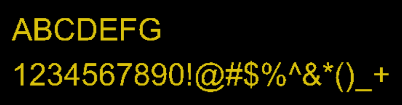

UIA Gerber File Parser
================

The implementation of this API is based on __Gerber Layer Format Specification - Revision 2024.05__.

## Current Progress

* __Gerber Layout File__ - All commands except `AM` could be written and read.

* __Gerber Job File__ - under development.

* __Text__ - Font `Arial` under testing.

## Build

The project uses the ANTLR plugin to generate java files automatically, you need to add `target/generated-sources/antlr4` in IDE __build path list__ before building the source code.  

## Examples

1. Reader

    ```java
    GerberX2FileReader reader = new GerberX2FileReader(new GerberX2Visitor.Console());
    reader.run(Paths.get("samples/gerber1.gbr"));
    ```

2. Writer

    ```java
    // create a writer.
    GerberX2FileWriter writer = new GerberX2FileWriter(System.out)
            .fs(4, 6)
            .description("TEST1 - Region");

    // start to write (streaming)
    writer.start();

    // get the graphics object.
    CommonGraphics x2g = writer.getGraphics();

    // create a region at (0.1mm, 0.1mm)
    x2g.createRegion(writer.xy(0.1), writer.y(0.1)) 
            .lineTo(writer.xy(0.1), writer.xy(0.5))   
            .lineTo(writer.xy(0.4), null)
            .cwTo(writer.xy(0.5), writer.xy(0.4), null, writer.xy(-0.1))
            .lineTo(writer.xy(0.5), writer.xy(0.1))
            .lineTo(writer.xy(0.1), null)
            .close();

    // change the polarity
    x2g.loadPolarity(false);

    // create a region  at (0.3mm, 0.3mm)
    x2g.createRegion(writer.xy(0.3), writer.xy(0.3))
            .lineTo(null, writer.xy(0.4))
            .lineTo(writer.xy(0.4), null)
            .lineTo(writer.xy(0.4), writer.xy(0.3))
            .lineTo(writer.xy(0.3), null)
            .close();

    // stop writing.
    writer.stop();
    ```

3. Write text
    ```java
    // create a writer.
    GerberX2FileWriter writer = new GerberX2FileWriter(System.out)
            .fs(4, 6);

    // start to write (streaming)
    writer.start();

    // get the graphics object.
    CommonGraphics x2g = writer.getGraphics();

    // create a text graphics
    TextGraphics tg = g.createText();
    tg.text("Demo Info", writer.xy(0.4), writer.xy(0.4), writer.xy(30), writer.xy(4));

    // stop writing.
    writer.stop();
    ```

    


## References

* [Ucamco Gerber Format](https://www.ucamco.com/en/gerber)

* [The Gerber Layout Format Specification](https://www.ucamco.com/files/downloads/file_en/456/gerber-layer-format-specification-revision-2024-05_en.pdf?0a46cf1c17c7347e12872141102ea536)

* [The Gerber Job Format Specification](https://www.ucamco.com/files/downloads/file_en/435/gerber-job-format-specification-revision-2020-08_en.pdf?81fa8076a5520c3ef5eb2f76d06a6f47)

* [ANTLR V4](https://www.antlr.org/)


## Copyright and License

Licensed under the Apache License, Version 2.0 (the "License");
you may not use this file except in compliance with the License.
You may obtain a copy of the License at

[http://www.apache.org/licenses/LICENSE-2.0](http://www.apache.org/licenses/LICENSE-2.0)

Unless required by applicable law or agreed to in writing, software
distributed under the License is distributed on an "AS IS" BASIS,
WITHOUT WARRANTIES OR CONDITIONS OF ANY KIND, either express or implied.
See the License for the specific language governing permissions and
limitations under the License.
